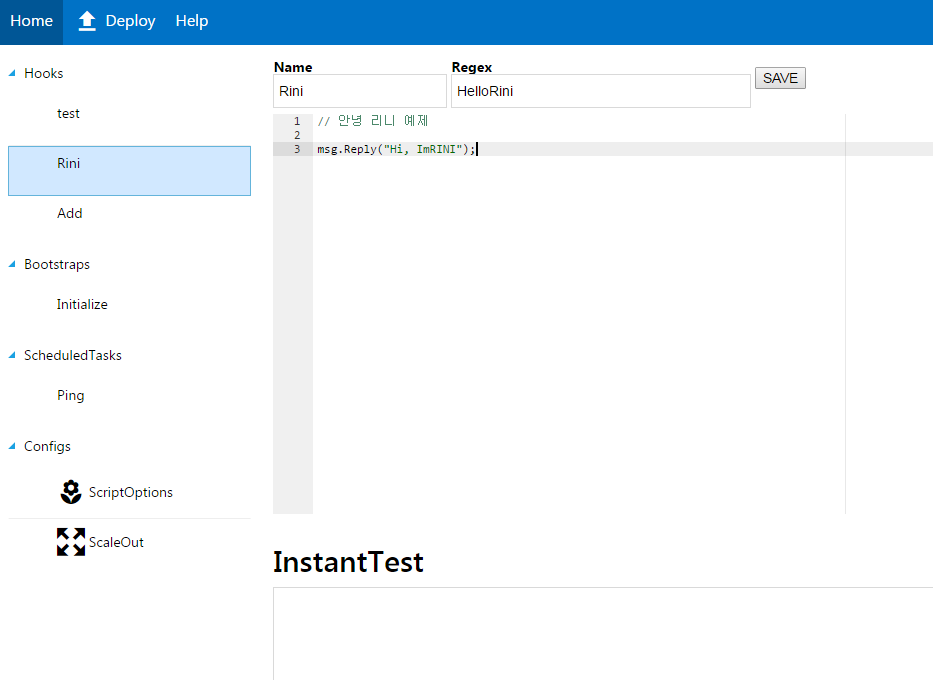
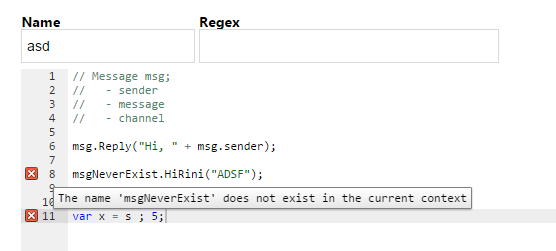

slacker-webconsole
====

 

lunning demo
----
https://www.youtube.com/watch?v=uHR4qJBPCvM

Stack
----
* nodejs + express
* angularjs 2.0 + typescript
* ace.js
* [metrocss](https://metroui.org.ua/)
* [Slacker](https://github.com/pjc0247/Slacker)
* mongol DB

DoTo
----

